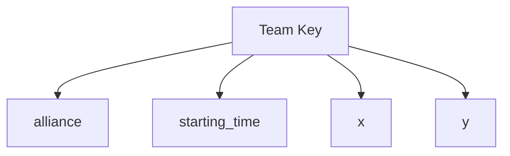
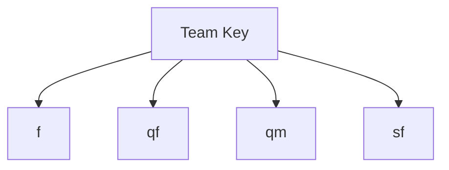
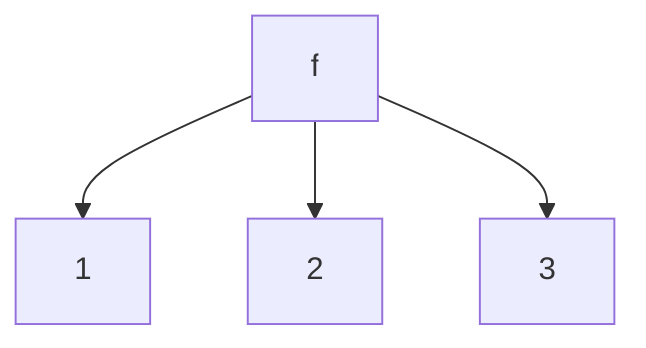
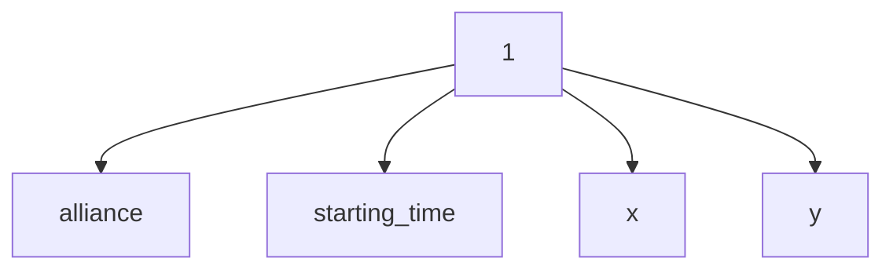
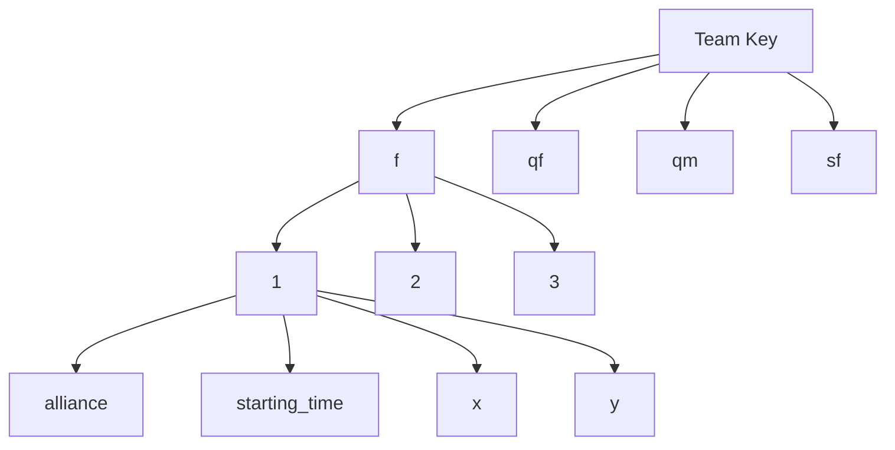

# Zebra-Beautify

The Blue Alliance API is one of the most helpful APIs for scouting. However, its Zebra MotionWorks data is pretty hard to use. Apart from being in a format that doesn't meet the needs of most applications for scouting, the lists also contain null values that can cause errors in the code. So to use Zebra MotionWorks data in my code, I created a class that solved these two issues. Using it to retrieve data from TBA will make scouting a little easier and save a lot of time.

## Setup

First, install Requests by typing the following command in your command prompt.

```
pip install requests
```

Then in a Python file separate from zebra.py, import Zebra.

```python
from zebra import Zebra
```

TBA API requires an authentication key, so you need to pass it in as a parameter when instantiating an object of class Zebra.

```python
  data_extractor = Zebra("your_auth_key")
```

## Getting Zebra MotionWorks Data for a Match

Then call the **get_match_zebra()** function and pass the match key as a parameter.

```python
data = data_extractor.get_match_zebra("match_key")
```

Some past Zebra MotionWorks data on TBA is missing a lot of coordinates from the start of the match. By default, the algorithm ignores any data where the first 10 coordinate pairs are missing(the first pair on 1.0 second or later). But you can change the maximum number of coordinate pairs missing for data to still be accepted.

For example, let's say you can tolerate the first 50 coordinate pairs missing.

```python
data = data_extractor.get_match_zebra("match_key", max_data_loss=50)
```

The output will have the team's data associated with the team's key.



The <em>alliance</em> will be set to the color of the alliance. It helps map the coordinates.

<em>starting_time</em> is the second of the match at which the first pair of coordinates was collected. Since coordinates are reported every 0.1 seconds, you can keep track of the second of the match by incrementing the time by 0.1 for each point.

<em>x</em> is the list of all x-coordinates.

<em>y</em> is the list of all y-coordinates.

```
Note: The max_data_loss will also be equal to the latest potential starting_time(converted to deciseconds) in your data set.
```

If this data gets put in a JSON file, it will look like this:

```js
{
	"frc0000": {
		"alliance": "",
		"starting_time": 0,
		"x": [],
		"y": []
	}
}
```

## Getting data for an event

To get the data for an event, you will need to call the function **get_event_zebra()** and pass the event key as a parameter.

```python
data = data_extractor.get_event_zebra("your_event")
```

Some past Zebra MotionWorks data on TBA is missing a lot of coordinates from the start of the match. By default, the algorithm ignores any data where the first 10 coordinate pairs are missing(the first pair on 1.0 second or later). But you can change the maximum number of coordinate pairs missing for data to still be accepted.

For example, let's say you can tolerate the first 50 coordinate pairs missing.

```python
data = data_extractor.get_event_zebra("your_event", max_data_loss=50)
```

## Formatting for event data

The generated dictionary will have a key for every team that data is available for. Then the data for that team will be categorized by the competition level.



```
Note: Competition levels are sorted alphabetically.
```

Then for each competition level, we will have data categorized by the match number.



Then for each match, these metrics will be provided.



The <em>alliance</em> will be set to the color of the alliance. It helps map the coordinates.

<em>starting_time</em> is the second of the match at which the first pair of coordinates was collected. Since coordinates are reported every 0.1 seconds, you can keep track of the second of the match by incrementing the time by 0.1 for each point.

<em>x</em> is the list of all x-coordinates.

<em>y</em> is the list of all y-coordinates.

```
Note: The max_data_loss will also be equal to the latest potential starting_time(converted to deciseconds) in your data set.
```

If that data is dumped into a JSON file, the format will look like this:

```js
{
	"frc0000": {
		"f": {
			"1": {
				"alliance": "",
				"starting_time": 0,
				"x": [],
				"y": []
			}
		}
	}
}
```

Summary Graph:



## License

MIT

